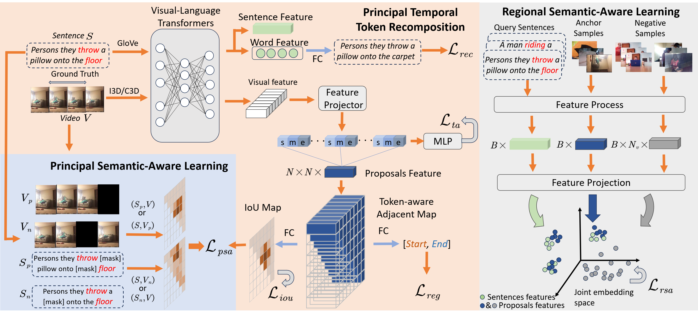

# PTAN: Principal Token-aware Adjacent Network for Compositional Temporal Grounding
Implementation for the paper "PTAN: Principal Token-aware Adjacent Network for Compositional Temporal Grounding" (ICMR 2024).

## Framework



## Environment
```bash
pip install -r requirements.txt
```


## Quick Start

### Data Preparation
For Charades-CG dataset, download https://github.com/YYJMJC/Compositional-Temporal-Grounding/tree/main/Charades-CG and put them under `data/Charades`.

For ActivityNet-CG dataset, download https://github.com/YYJMJC/Compositional-Temporal-Grounding/tree/main/ActivityNet_CG and put them under `data/ActivityNet`.

We use [I3D features](https://app.box.com/s/h0sxa5klco6qve5ahnz50ly2nksmuedw) for the videos in Charades-CG and [C3D features](http://activity-net.org/challenges/2016/download.html) for the videos in ActivityNet-CG, please save them to the `data/` folder. We expect the directory structure to be the following:

```
data
├── activitynet
│   ├── sub_activitynet_v1-3.c3d.hdf5
│   ├── train.json
│   ├── test_trivial.json
│   ├── novel_composition.json
│   ├── novel_word.json
│   ├── words_vocab.json
├── charades
│   ├── i3d_features.hdf5
│   ├── train.json
│   ├── test_trivial.json
│   ├── novel_composition.json
│   ├── novel_word.json
│   ├── words_vocab.json
```


### Training
Use the following commands for training:
```
# For Charades-CG
CUDA_VISIBLE_DEVICES=0 python train.py --cfg experiments/charades/PTAN.yaml --verbose

# For ActivityNet-CG
CUDA_VISIBLE_DEVICES=0 python train.py --cfg experiments/activitynet/PTAN.yaml --verbose
```
If you want to save the model weights during training, please change the `SAVE_CHECKPOINT` parameter in `/experiments/charades/CLARE.yaml` to True.
The model weights during training are saved in `checkpoints/` by default and can be modified in the configuration file.
